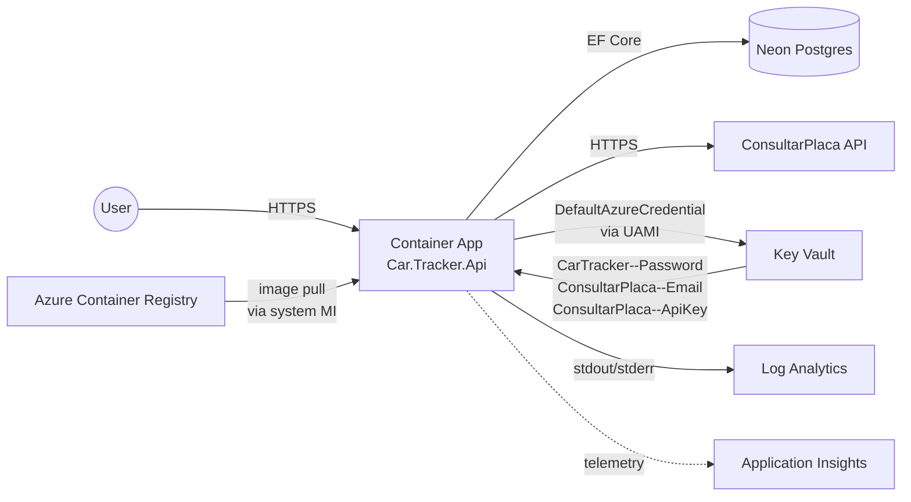

# Deployment Plan — Car Tracker API

| Status | Ready for Validation |
|--------|----------------------|
| Recipe | AZD (Azure Developer CLI) |
| IaC | Bicep |
| Compute | Azure Container Apps |
| Mode | NEW |

## 1. Workspace Analysis

Existing .NET 10 monolith:

- API host: `src/Car.Tracker.Api` (ASP.NET Core, serves both REST + SPA static files via `wwwroot`)
- Frontend: `src/Car.Tracker.Presentation` (React + Vite, builds to `dist/`; wired into the API publish via `SpaRoot` in the csproj)
- Domain / Application / Infrastructure / Contracts class libs
- Tests: `src/Car.Tracker.Tests` (xUnit), `src/Car.Tracker.IntegrationTests` (xUnit + docker-compose)
- Existing Dockerfile at `src/Car.Tracker.Api/Dockerfile` (used for integration tests; does not build the SPA today)
- Existing partial Bicep at `infra/main.bicep` from a prior task (Key Vault + UAMI + secrets) — refactored here into AZD-shaped modules.

Mode: **NEW** (no `azure.yaml`, no AZD-managed infra yet).

## 2. Requirements

| Item | Decision |
|------|----------|
| Classification | Internal-facing web API + SPA, single deployable unit |
| Scale | Low / spiky — auto-scale to zero acceptable |
| Budget | Keep low — Consumption tier wherever possible |
| Database | External Neon Postgres (already in use; no Azure-managed DB) |
| Secrets | Azure Key Vault (DB password, ConsultarPlaca email + API key) |
| Auth (app → Azure) | DefaultAzureCredential via User-Assigned Managed Identity |

## 3. Codebase Scan

| Component | Tech | Azure Mapping |
|-----------|------|---------------|
| `Car.Tracker.Api` | ASP.NET Core 10, EF Core (runs migrations on startup), Npgsql | Container Apps |
| `Car.Tracker.Presentation` | Vite + React 19 + TS, builds to `dist/` | Bundled into the same container (copied to `wwwroot/`) |
| ConsultarPlaca outbound HTTP | `HttpClient` | Egress from Container App — no extra infra |
| Neon Postgres | External | Connection string built in [`CarTrackerConnectionString.cs`](../src/Car.Tracker.Api/Configuration/CarTrackerConnectionString.cs); password sourced from Key Vault |

## 4. Recipe Selection

**AZD + Bicep**. Single .NET service with a Dockerfile is the canonical AZD use case. AZD also handles the ACR `registry set --identity` step automatically, removing a manual Bicep wiring pitfall.

## 5. Architecture



### Resource inventory

| Resource | Purpose | SKU |
|----------|---------|-----|
| Resource group | `rg-${environmentName}` | — |
| User-Assigned Managed Identity | App identity for Key Vault | — |
| Key Vault | Secret store, RBAC mode | Standard |
| Azure Container Registry | App image hosting | Basic |
| Log Analytics workspace | ACA logs + AI backend | PerGB2018 |
| Application Insights | App telemetry | workspace-based |
| Container Apps Environment | ACA runtime | Consumption |
| Container App | The API + SPA | Consumption (min 0 / max 3 replicas) |

### Identity model

- **User-Assigned MI** (`id-cartracker-${env}`): attached to the Container App; granted `Key Vault Secrets User` on the vault.
- **System-Assigned MI** on the Container App: granted `AcrPull` on the ACR (set in Phase 2 module). AZD wires the registry/identity link via `az containerapp registry set --identity system` on deploy.
- The app sets `AZURE_CLIENT_ID` = UAMI client ID so `DefaultAzureCredential` selects the UAMI even though both identities are attached.

### Secret material

Secrets are **not** baked into Bicep. The vault is provisioned empty; values are seeded once via:

```bash
az keyvault secret set --vault-name <vault> --name 'CarTracker--Password' --value '<neon-pwd>'
az keyvault secret set --vault-name <vault> --name 'ConsultarPlaca--Email' --value '<email>'
az keyvault secret set --vault-name <vault> --name 'ConsultarPlaca--ApiKey' --value '<api-key>'
```

The app's Key Vault config provider (already wired in [`KeyVaultConfigurationExtensions.cs`](../src/Car.Tracker.Api/Configuration/KeyVaultConfigurationExtensions.cs)) maps `Foo--Bar` → `Foo:Bar` on read, so no consumer code changes.

## 6. Files

### New / refactored

| File | Purpose |
|------|---------|
| [azure.yaml](../azure.yaml) | AZD service map: `api` → containerapp, points at `src/Car.Tracker.Api/Dockerfile` |
| [.dockerignore](../.dockerignore) | Trims build context |
| [infra/main.bicep](../infra/main.bicep) | Subscription-scoped orchestrator; creates RG; wires modules |
| [infra/main.parameters.json](../infra/main.parameters.json) | AZD `${VAR}` placeholders |
| [infra/modules/monitoring.bicep](../infra/modules/monitoring.bicep) | Log Analytics + App Insights |
| [infra/modules/identity.bicep](../infra/modules/identity.bicep) | UAMI |
| [infra/modules/keyvault.bicep](../infra/modules/keyvault.bicep) | Key Vault + role assignments (UAMI + deployer) |
| [infra/modules/registry.bicep](../infra/modules/registry.bicep) | ACR |
| [infra/modules/container-env.bicep](../infra/modules/container-env.bicep) | ACA managed environment |
| [infra/modules/container-app.bicep](../infra/modules/container-app.bicep) | The app (Phase 1, placeholder image, both identities) |
| [infra/modules/acr-pull-role.bicep](../infra/modules/acr-pull-role.bicep) | AcrPull → app system MI (Phase 2) |
| [src/Car.Tracker.Api/Dockerfile](../src/Car.Tracker.Api/Dockerfile) | Multi-stage: Node SPA build + .NET publish + runtime |

### Unchanged (still in use)

- [src/Car.Tracker.Api/Configuration/KeyVaultConfigurationExtensions.cs](../src/Car.Tracker.Api/Configuration/KeyVaultConfigurationExtensions.cs) — already wires Key Vault into IConfiguration when `KeyVault:Url` is set.
- [src/Car.Tracker.Api/DependencyInjection/WebApplicationBuilderExtensions.cs](../src/Car.Tracker.Api/DependencyInjection/WebApplicationBuilderExtensions.cs) — calls the above as the first step.

## 7. Container app environment variables

Set by the `container-app.bicep` module (no secrets — only Key Vault URL + selector for the UAMI):

| Variable | Source | Example |
|----------|--------|---------|
| `ASPNETCORE_URLS` | hardcoded | `http://0.0.0.0:8080` |
| `KeyVault__Url` | KV module output | `https://<vault>.vault.azure.net/` |
| `AZURE_CLIENT_ID` | UAMI client ID | UAMI client ID — makes DefaultAzureCredential select the UAMI |
| `CarTracker__Host` | param (default Neon prod host) | `ep-...neon.tech` |
| `CarTracker__Database` | param | `car_tracker` |
| `CarTracker__Username` | param | `neondb_owner` |
| `CarTracker__Port` | param | `5432` |
| `ConsultarPlaca__Url` | param | `https://api.consultarplaca.com.br/v2` |
| `APPLICATIONINSIGHTS_CONNECTION_STRING` | AI module output | (telemetry — even if app doesn't yet integrate AI SDK, ACA will surface it later) |

Password + ConsultarPlaca email/ApiKey come from Key Vault at runtime — not env vars.

## 8. Deployment flow

```bash
# One-time
azd auth login
azd init --environment cartracker-dev   # detects existing azure.yaml
azd env set AZURE_LOCATION eastus
# Optional overrides (defaults are baked into Bicep):
# azd env set CARTRACKER_HOST '...'
# azd env set CONSULTAR_PLACA_URL '...'

# Provision infra
azd provision

# Seed Key Vault secrets (one-time, manual; or re-run after rotation)
VAULT=$(azd env get-values --output json | jq -r .AZURE_KEY_VAULT_NAME)
az keyvault secret set --vault-name "$VAULT" --name 'CarTracker--Password' --value '<neon-pwd>'
az keyvault secret set --vault-name "$VAULT" --name 'ConsultarPlaca--Email' --value '<email>'
az keyvault secret set --vault-name "$VAULT" --name 'ConsultarPlaca--ApiKey' --value '<api-key>'

# Build + push image + roll the container app
azd deploy
```

## 9. Out of scope

- CI/CD pipeline (GitHub Actions). `azd pipeline config` can generate one later.
- Custom domain / TLS cert binding.
- Private endpoints / VNet for ACA + KV + ACR.
- Managed Postgres in Azure — Neon stays.
- Automated secret seeding hook — kept manual to avoid storing secrets in `.azure/` state.

## 10. Next step

This plan's status is `Ready for Validation`. The next step is to invoke the **azure-validate** skill before any `azd up`/`azd deploy`.
